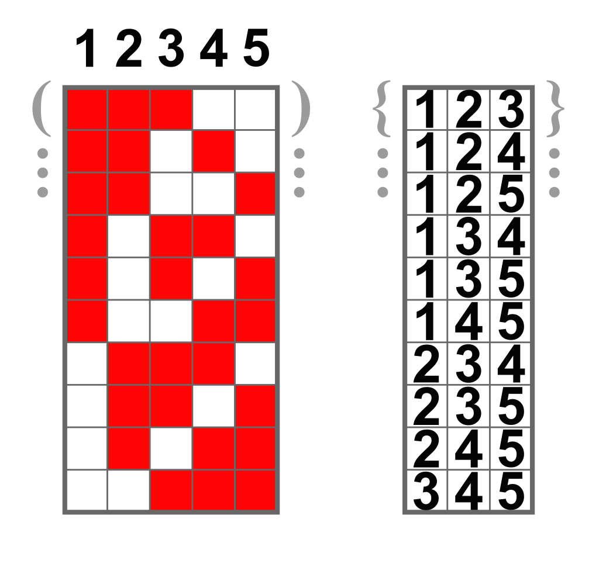
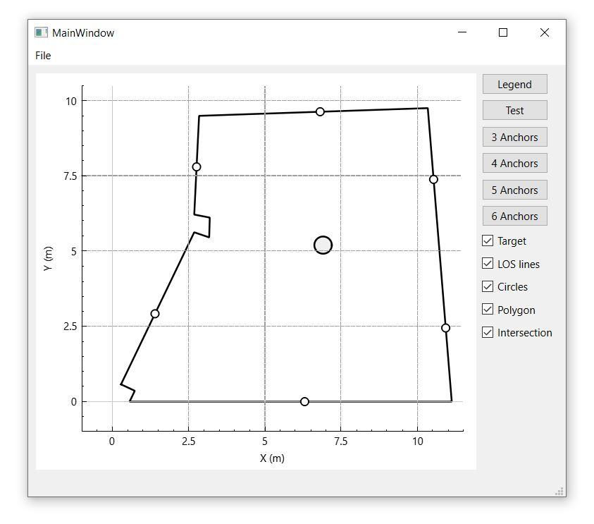
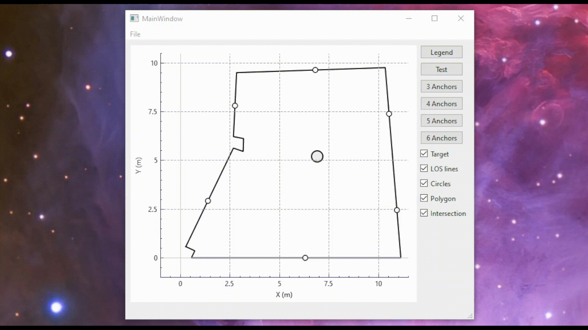
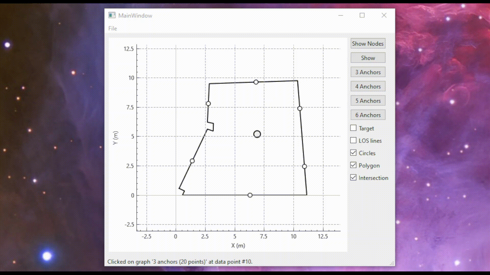

# Multi-Lateration Test Tool

At some point during my [thesis](https://ikee.lib.auth.gr/record/350727/?ln=en), a colleague asked me to explain what exactly was multi-lateration. My first response was to describe the mathematical formula. But when he asked me "What is the geometric interpretation of all that?", I realized I didn't know. So to find out, I made this little app.

This app was developed in [Qt Creator](https://www.qt.io/product/development-tools) version 5.14. All the 2-D plots were implemented using the [QCustomPlot](https://www.qcustomplot.com/) library. The app was deployed for Windows only (sorry about that). You can download the latest release [here](https://github.com/gemargar/testMap/releases/tag/v0.1).

## Theoretical Background

Before presenting the software, it would be wise to define some terms. The general idea behind most 2-D indoor positioning systems is that 3 or more stationary devices with known position (anchors) measure their distance (range) from 1 one moving device (target). By obtaining at least 3 distances from 3 known points in 2-D space, the position of the target can be evaluated. For 3 distances, the algorithm is called [trilateration](https://en.wikipedia.org/wiki/Trilateration); for more than 3 the term multilateration is used.

## Trilateration vs multilateration

The geometric interpretation of trilateration is that **the position of the target is the intersecting point of 3 circles with centers the anchors and radiuses the corresponding ranges**. The intersecting point's coordinates can be found through the circles' equations.

```math
\displaylines{
(x-x_1)^2+(y-y_1)^2=R_1^2 \\
(x-x_2)^2+(y-y_2)^2=R_2^2 \\
(x-x_3)^2+(y-y_3)^2=R_3^2
}
```

By subtracting the first from the other two, the circle equations transform to line equations. The point where the two lines cross is the intersecting point of the 3 circles.

```math
\displaylines{
2x(x_1-x_2)+2y(y_1-y_2) = R_2^2-R_1^2-x_2^2-y_2^2+x_1^2+y_1^2 \\
2x(x_1-x_3)+2y(y_1-y_3) = R_3^2-R_1^2-x_3^2-y_3^2+x_1^2+y_1^2
}
```

or in matrix notation:

```math
\underbrace{2\begin{bmatrix} x_1-x_2 & y_1-y_2 \\ x_1-x_3 & y_1-y_3 \end{bmatrix}}_\text{A}
\underbrace{\begin{bmatrix} x \\ y \end{bmatrix}}_\text{x} = 
\underbrace{\begin{bmatrix} R_2^2-R_1^2-x_2^2-y_2^2+x_1^2+y_1^2 \\ R_3^2-R_1^2-x_3^2-y_3^2+x_1^2+y_1^2 \end{bmatrix}}_\text{b}
\Longrightarrow Ax=b
```

The coordinate vector can be found as follows:

```math
x = A^{-1}b
```

If more than 3 anchors are available, the multilateration equation forms as follows:

```math
x = (A^T A)^{-1}A^Tb
```

## Combinations

If more than 3 anchors are available, one can reach to a number of solutions, each one corresponding to a set of data (ranges) of a certain [combination](https://en.wikipedia.org/wiki/Combination) of anchors. The number of $C(n,k)$ sets of $k$ out of $n$ available devices is given from the following formula:

```math
C(n,k) = \binom{n}{k} = \frac{n!}{k!(n-k)!}
```

For example, if 5 anchors are available, the number of possible sets of 3 out of 5 is equal to:

```math
C(5,3) = \binom{5}{3} = \frac{5!}{3!(5-3)!} = 10
```

This process is depicted in the following picture.

<p align="center">

</p>

Similarly, one can obtain solutions by performing multilateration with 4 and 5 ranges. For 5 anchors available, there are $C(5,4) = 5$ multilateration solutions with 4 ranges and one multilateration with all 5 ranges. In total, one can obtain $10+5+1=16$ target coordinates.

For ideal conditions, where there's no error in the ranges, all the above combination of 3, 4 and 5 anchors would yield the same point in space. In reality, due to errors in the ranging process, these points differ from one another. The question is: **"Which combination of anchors yields the best results?"** That was the purpose of this little app.

## Running the app

To run the application, simply double-click the "testMap.exe" located inside the "testMap_Release" folder. The following window will show up.



The axis system depicts the top view of the Electronics Laboratory. The gray circle in the middle is a vertical column that streches from the floor to the ceiling, while the small circles around the walls are the anchors. There are 6 anchors in total giving $C(6,3) = 20$ trilateration results, $C(6,4) = 15$ multilateration with 4 ranges, $C(6,5) = 6$ multilateration with 5 ranges and $C(6,4) = 1$ multilateration with 6 ranges. These add up to [42](https://en.wikipedia.org/wiki/Phrases_from_The_Hitchhiker%27s_Guide_to_the_Galaxy#Answer_to_the_Ultimate_Question_of_Life,_the_Universe,_and_Everything_(42)) different solutions. 

## Controls and buttons

On the right hand side of the window there are 6 buttons and 5 check boxes that implement the functionalities described in the next sections. The first two push-buttons (Legend & Test) provide an overall picture of the app's functionality, while the rest buttons (3, 4, 5 & 6 Anchors) give more information about the nature of multilateration. The check boxes interact with these last buttons and not with the first ones.

### Legend

The app contains ranging data from 23 points in the room. The target was stationed in all these points and ranging measurements were conducted. The data were saved in csv format and are included in the "stationary" folder. The purpose of the app is for the user to visualize all the 42 available solutions and see how the position of the anchors relative to the target affect the solutions accuracy. This push-button lists all the points in space with available datasets. Upon clicking the button, its label changes to "Hide Nodes". If clicked again, the legend disappears.



### Open a file and Test

Having consulted the legend, it's time to select the desired dataset. By navigating to "File->Range File", one can choose one of the 23 available csv files. The point that corresponds to each file can be found in the legend [here](legend.pdf). If no selection is made, point A is set by default.


### Test

This push-button draws all 42 solutions for the selected ranging file. By using mouse drag and mouse wheel, the user can zoom in and out. By clicking on one of the solutions, the anchors taking part in the calculation are highlighted with lines connecting them to the corresponding coordinates. Moreover, the shape formed by these anchors is highlighted with yellow color.


### 3 Anchors

This push-button draws all 20 solutions that result from trilateration, using ranges from 3 anchors at a time. By clicking on the button, the solutions are drawn one by one. The button's label is updated, listing the anchors taking part into the solution. For example, "123" uses ranges from the 3 first anchors, "124" uses ranges from anchors 1, 2 and 4 and so on.

Along with the target's estimated location, by ticking the corresponding check-box, the user can select some additional characteristics to be plotted.
- **Target** plots the coordinates resulting from the calculation.
- **LOS lines** plot the lines that connect the anchors and the target. This enables the user can check for NLOS phenomena (obstacles hiding an anchor from the target)
- **Circles** plots the circles with center the anchor position and radius the corresponding range. This enables the user to see how much the intersecting points of each pair of circles deviate from one another (the "error" area).
- **Polygon** plots the shape that is formed by the anchors that take part into the calculation. This enables the user to form an empirical opinion about the correlation between the relative position of the target and the target that take part in the calculation.
- **Intersection** plots the lines that correspond to the transformed equations (see section [Trilateration vs multilateration](https://github.com/gemargar/testMap?tab=readme-ov-file#trilateration-vs-multilateration)). For the trilateration, the intersecting point of the two lines coincide with the solution. For multi-lateration, the intersecting points are not connected to the solution, however they provide a 


### 4 Anchors

This push-button draws all 15 solutions that result from multilateration using ranges from 4 anchors at a time.



### 5 Anchors

This push-button draws all 6 solutions that result from multilateration using ranges from 5 anchors a time.


### 6 Anchors

This push-button draws the solution that result from multilateration using ranges from all 6 anchors.


